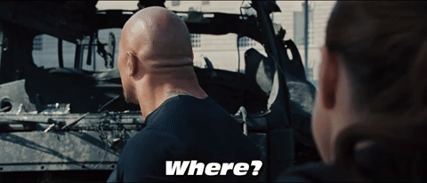

# 04. Rotten Tomatoes 🍅

## WHERE Clause in SQL

Want to filter data based on certain conditions? That’s where the `WHERE` clause comes in.





### Basic Syntax:

```sql
SELECT *
FROM shows
WHERE id = 23;
```

📌 This will return only the show(s) where `id = 23`.

---

### Another Example:

```sql
SELECT *
FROM shows
WHERE year > 2020;
```

📌 This filters and returns only the shows released after 2020.

> 📝 **Note:** The `WHERE` clause **always** comes after the `FROM` clause in a SQL query.

---

## 🧮 Comparison Operators in SQL

Here are the operators you can use inside a `WHERE` clause to filter results:

| Operator | Meaning                     |
|----------|-----------------------------|
| =        | Equal to                    |
| !=       | Not equal to                |
| >        | Greater than                |
| <        | Less than                   |
| >=       | Greater than or equal to    |
| <=       | Less than or equal to       |

---

## 🎬 Rotten Tomatoes Criteria

Rotten Tomatoes is a review site started by UC Berkeley students.

- 🍅 **Fresh**: If ≥ 60% of reviews are positive.
- 🦠 **Rotten**: If < 60% of reviews are positive.

---

### 🔍 Task:

Find all the shows in the table that **bombed** (i.e., with a tomatometer score less than 60):

```sql
SELECT *
FROM shows
WHERE tomatometer < 60;
```

Time to uncover the flops! 💥

Source Credit : All content adapted from the [Codedex](https://www.codedex.io) website From SQL Learning Path ❤️
